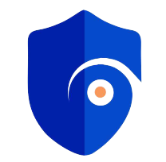

# e-Safe

created with

## Note for developers working on this project:

- Work from a branch in your name so it can be easily identified
- You're to work on issues assigned to you
- Keep all files in their folders and map them properly
- Do not add assets without permission